# DotNetDevMCP - Architecture Documentation

**Version**: 0.1.0-alpha
**Last Updated**: December 31, 2025

---

## Table of Contents

1. [System Overview](#system-overview)
2. [Architectural Principles](#architectural-principles)
3. [Component Diagrams](#component-diagrams)
4. [Sequence Diagrams](#sequence-diagrams)
5. [Data Flow Diagrams](#data-flow-diagrams)
6. [Deployment Architecture](#deployment-architecture)
7. [Technology Stack](#technology-stack)
8. [Design Patterns](#design-patterns)

---

## System Overview

DotNetDevMCP is a layered, modular system designed to provide AI assistants with comprehensive .NET development capabilities through the Model Context Protocol (MCP).

### High-Level Architecture

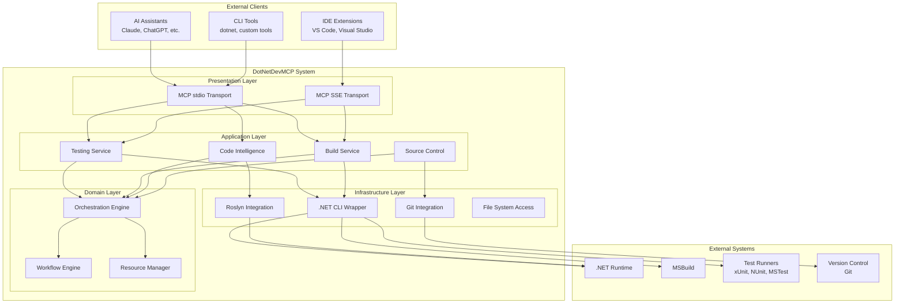

---

## Architectural Principles

### 1. Separation of Concerns

Each layer has a distinct responsibility:

- **Presentation Layer**: MCP protocol handling and transport
- **Application Layer**: Business logic and use cases
- **Domain Layer**: Core orchestration and coordination
- **Infrastructure Layer**: External system integration

### 2. Dependency Inversion

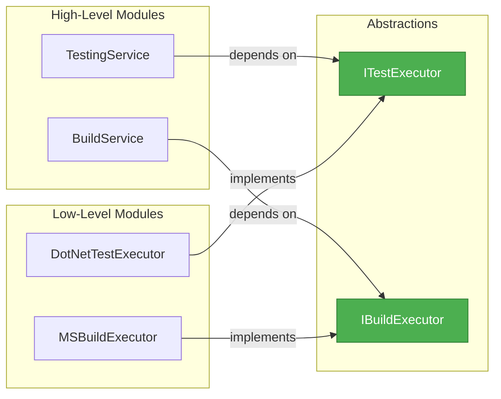

### 3. Single Responsibility Principle

Each class has one reason to change:

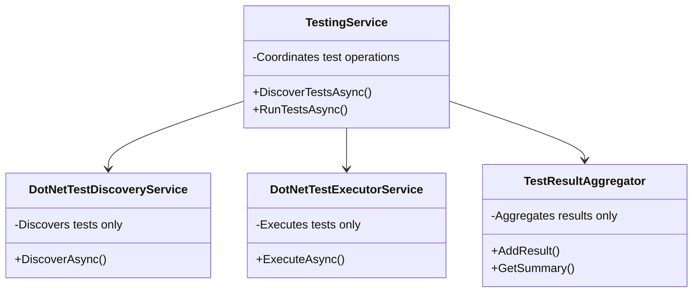

### 4. Composition Over Inheritance

Services are composed of smaller, focused components rather than deep inheritance hierarchies.

### 5. Async-First Design

All I/O operations are asynchronous with proper cancellation support.

---

## Component Diagrams

### Core Components

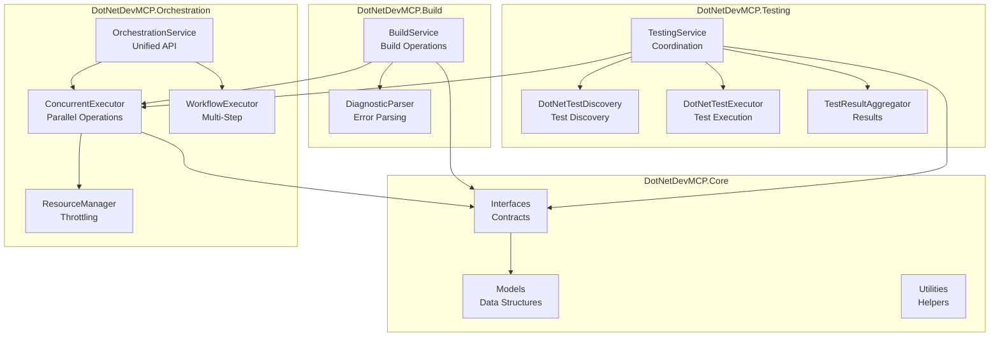

### Testing Service Architecture

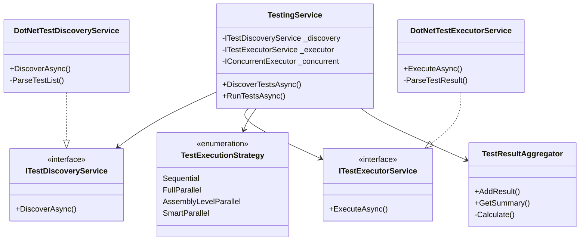

### Orchestration Architecture

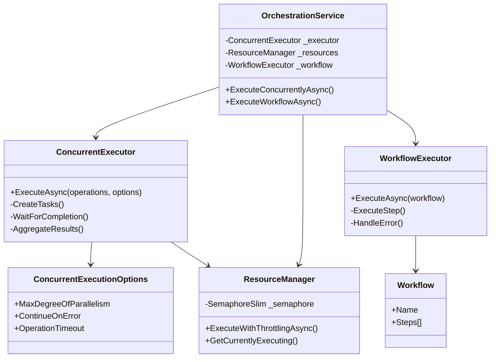

---

## Sequence Diagrams

### Test Execution Flow (Sequential)

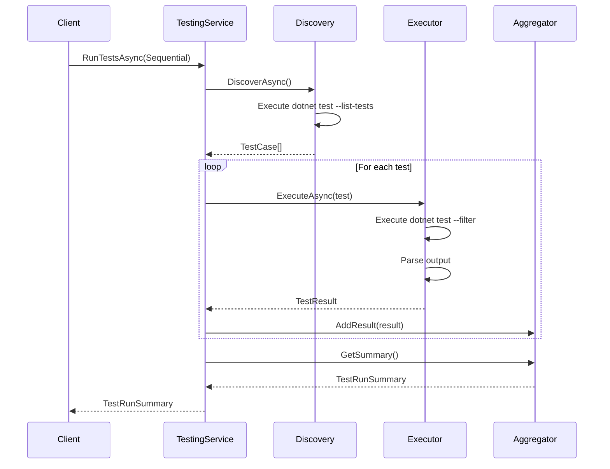

### Test Execution Flow (Parallel)

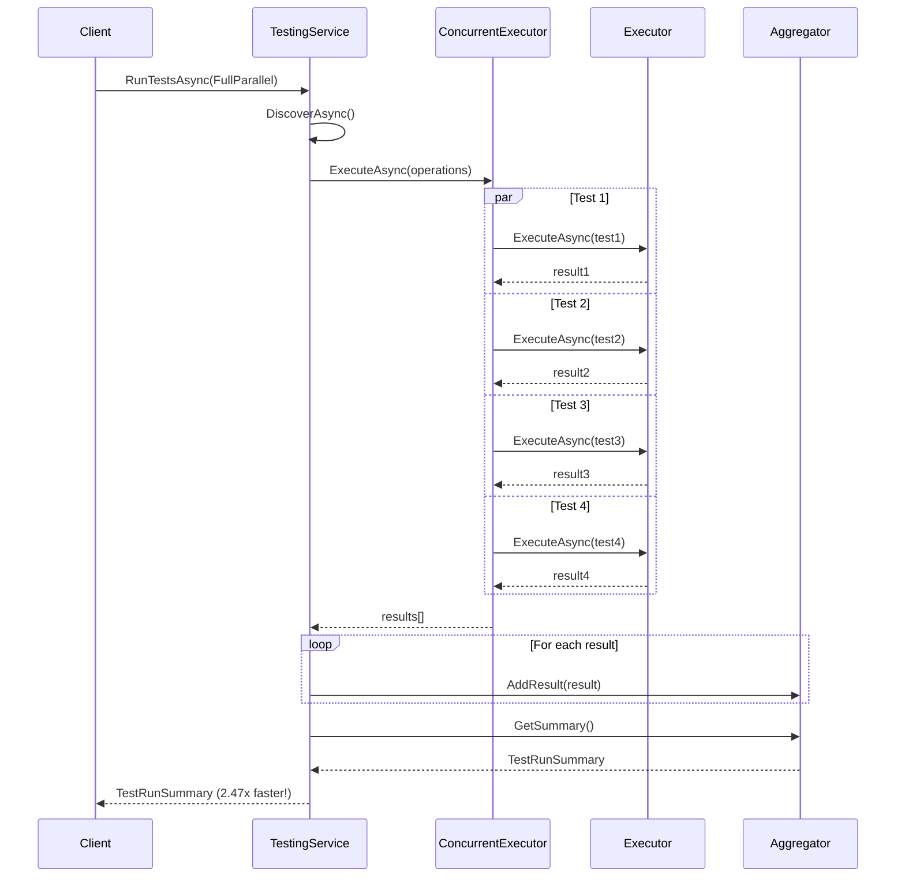

### Build Process Flow

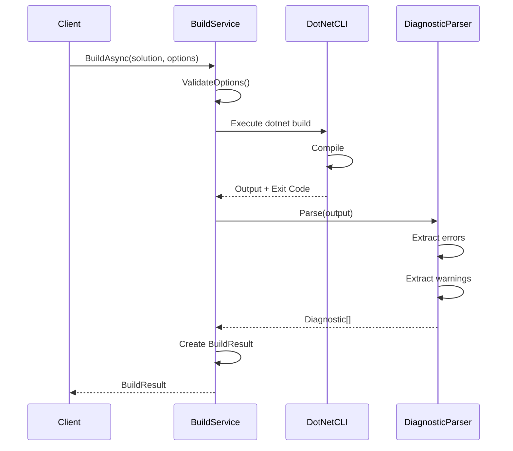

### Workflow Execution Flow

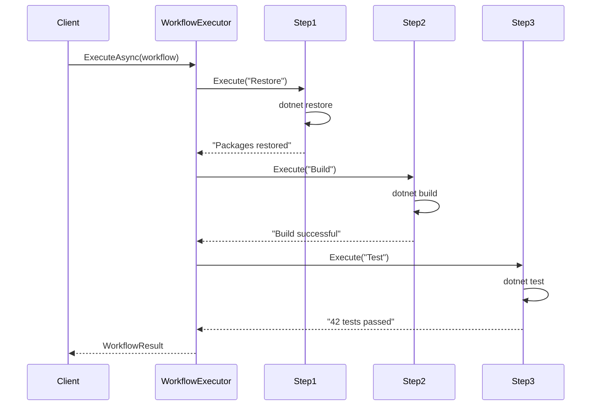

---

## Data Flow Diagrams

### Test Discovery Data Flow

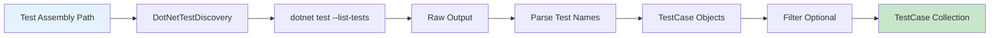

### Test Execution Data Flow

```mermaid
graph TB
    A[TestCase[]] --> B{Execution Strategy}

    B -->|Sequential| C[Execute One by One]
    B -->|FullParallel| D[Execute All Parallel]
    B -->|AssemblyParallel| E[Group by Assembly]
    B -->|SmartParallel| F[Group by Duration]

    C --> G[Execute Test]
    D --> H[ConcurrentExecutor]
    E --> I[Assembly Groups]
    F --> J[Duration Groups]

    H --> G
    I --> H
    J --> H

    G --> K[Parse Result]
    K --> L[TestResult]
    L --> M[TestResultAggregator]
    M --> N[TestRunSummary]

    style A fill:#e3f2fd
    style N fill:#c8e6c9
```

### Build Data Flow

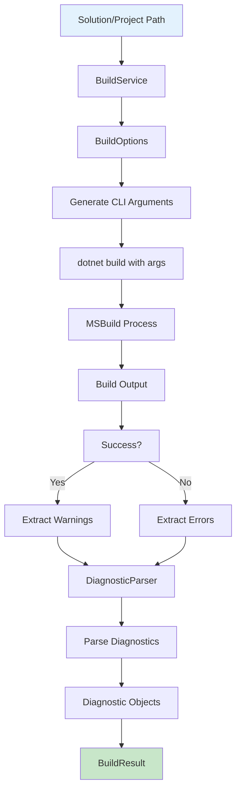

---

## Deployment Architecture

### Local Development

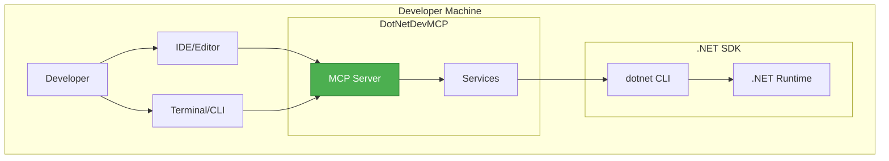

### CI/CD Pipeline

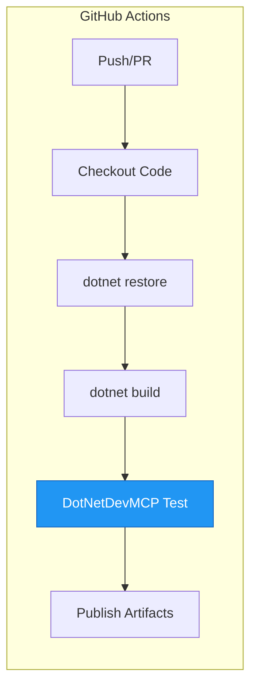

### Production Deployment (Future)

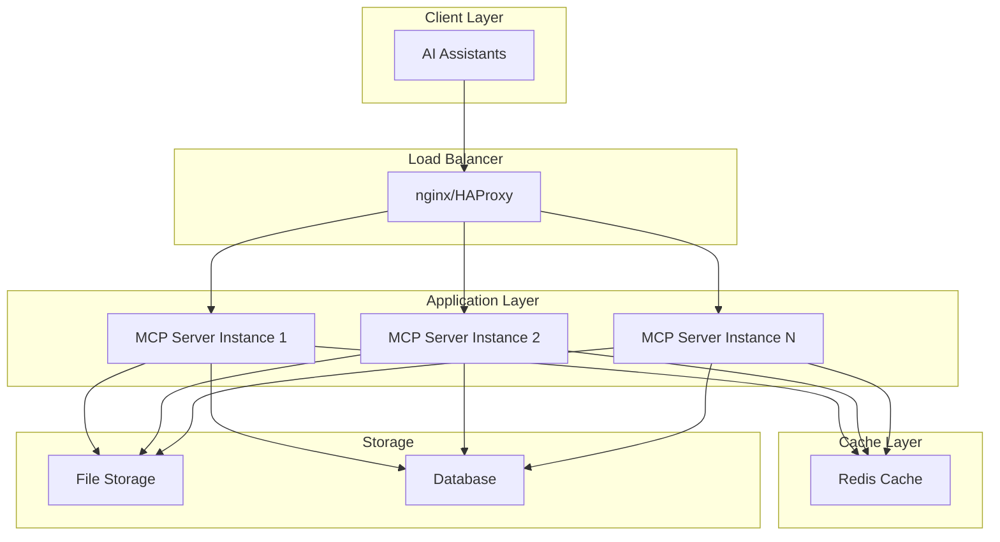

---

## Technology Stack

### Runtime & Platform

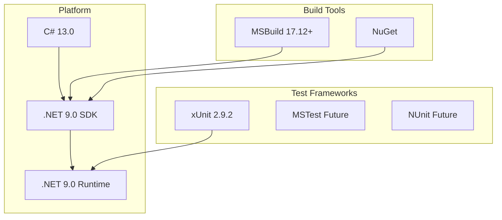

### Core Libraries

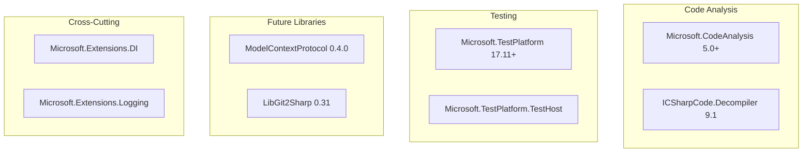

---

## Design Patterns

### 1. Strategy Pattern (Test Execution)

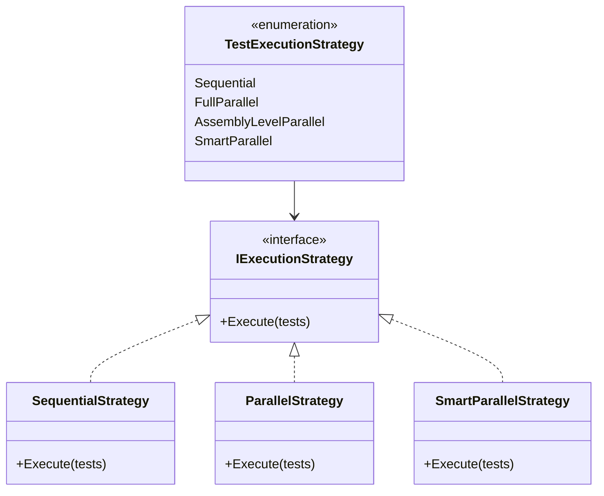

### 2. Facade Pattern (OrchestrationService)

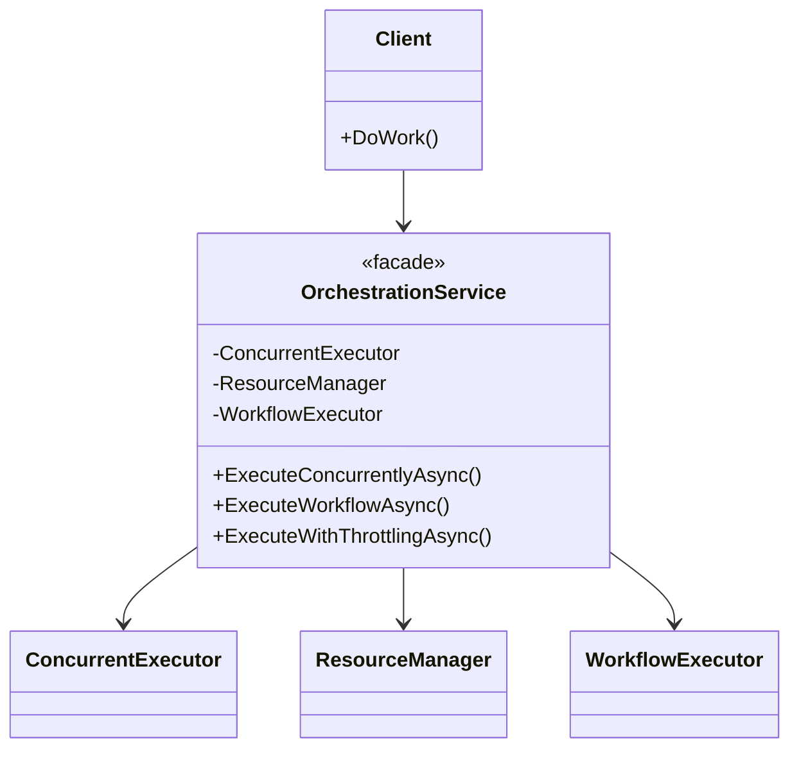

### 3. Builder Pattern (Test/Build Options)

```mermaid
classDiagram
    class TestExecutionOptions {
        +Strategy
        +DefaultTimeout
        +MaxDegreeOfParallelism
        +ContinueOnError
    }

    class TestExecutionOptionsBuilder {
        +WithStrategy()
        +WithTimeout()
        +WithParallelism()
        +Build()
    }

    TestExecutionOptionsBuilder --> TestExecutionOptions : creates
```

### 4. Observer Pattern (Progress Reporting)

```mermaid
classDiagram
    class IProgress~T~ {
        <<interface>>
        +Report(value)
    }

    class ProgressReporter {
        +OnProgressChanged
        +Report(value)
    }

    class TestingService {
        +RunTestsAsync(progress)
        -ReportProgress()
    }

    IProgress <|.. ProgressReporter
    TestingService --> IProgress : uses
```

### 5. Repository Pattern (Future - Test Results)

```mermaid
classDiagram
    class ITestResultRepository {
        <<interface>>
        +SaveAsync(result)
        +GetByIdAsync(id)
        +GetAllAsync()
    }

    class TestResultRepository {
        +SaveAsync(result)
        +GetByIdAsync(id)
        +GetAllAsync()
    }

    class TestingService {
        -ITestResultRepository _repository
        +RunTestsAsync()
    }

    ITestResultRepository <|.. TestResultRepository
    TestingService --> ITestResultRepository
```

---

## Component Responsibilities

### DotNetDevMCP.Core
- **Purpose**: Foundation layer with shared abstractions
- **Responsibilities**:
  - Define core interfaces
  - Provide shared data models
  - Utility functions
- **Dependencies**: None (foundation layer)

### DotNetDevMCP.Orchestration
- **Purpose**: Concurrent execution and workflow management
- **Responsibilities**:
  - Parallel operation execution
  - Resource throttling
  - Multi-step workflow coordination
- **Dependencies**: Core

### DotNetDevMCP.Testing
- **Purpose**: Test discovery and execution
- **Responsibilities**:
  - Discover tests from assemblies
  - Execute tests with various strategies
  - Aggregate and report results
- **Dependencies**: Core, Orchestration

### DotNetDevMCP.Build
- **Purpose**: Build automation
- **Responsibilities**:
  - Build, clean, restore operations
  - Diagnostic parsing
  - Build result reporting
- **Dependencies**: Core, Orchestration

### DotNetDevMCP.CodeIntelligence
- **Purpose**: Code analysis and manipulation
- **Responsibilities**:
  - Symbol navigation
  - Find references
  - Code refactoring
- **Dependencies**: Core, Roslyn

### DotNetDevMCP.Server (Future)
- **Purpose**: MCP protocol implementation
- **Responsibilities**:
  - Protocol handling
  - Transport management (stdio/SSE)
  - Tool registration
- **Dependencies**: All services

---

## Performance Considerations

### Parallelization

```mermaid
graph LR
    A[Input Operations] --> B{Parallelizable?}
    B -->|Yes| C[ConcurrentExecutor]
    B -->|No| D[Sequential Execution]

    C --> E[Resource Manager]
    E --> F{Semaphore Available?}
    F -->|Yes| G[Execute]
    F -->|No| H[Wait]
    H --> F

    G --> I[Aggregate Results]
    D --> I

    style C fill:#4CAF50,stroke:#2E7D32,color:#fff
```

### Caching Strategy (Future)

```mermaid
graph TB
    REQUEST[Request] --> CACHE{In Cache?}
    CACHE -->|Yes| RETURN[Return Cached]
    CACHE -->|No| EXECUTE[Execute Operation]
    EXECUTE --> STORE[Store in Cache]
    STORE --> RETURN

    style CACHE fill:#FF9800,stroke:#E65100,color:#fff
```

---

## Security Architecture

### Trust Boundaries

```mermaid
graph TB
    subgraph "Untrusted Zone"
        USER[User Input]
        EXTERNAL[External Code]
    end

    subgraph "Trusted Zone"
        VALIDATOR[Input Validator]
        SANDBOX[Sandboxed Execution]
        SERVICES[DotNetDevMCP Services]
    end

    USER --> VALIDATOR
    EXTERNAL --> SANDBOX
    VALIDATOR --> SERVICES
    SANDBOX --> SERVICES

    style VALIDATOR fill:#F44336,stroke:#C62828,color:#fff
    style SANDBOX fill:#F44336,stroke:#C62828,color:#fff
```

---

## Extensibility Points

### Plugin Architecture (Future)

```mermaid
graph TB
    subgraph "Core System"
        PLUGIN_MGR[Plugin Manager]
        REGISTRY[Plugin Registry]
    end

    subgraph "Plugins"
        CUSTOM_TEST[Custom Test Provider]
        CUSTOM_BUILD[Custom Build Provider]
        CUSTOM_ANALYZER[Custom Analyzer]
    end

    PLUGIN_MGR --> REGISTRY
    CUSTOM_TEST --> REGISTRY
    CUSTOM_BUILD --> REGISTRY
    CUSTOM_ANALYZER --> REGISTRY

    style PLUGIN_MGR fill:#9C27B0,stroke:#6A1B9A,color:#fff
```

---

**Document Version**: 1.0
**Last Review**: December 31, 2025
**Next Review**: Quarterly

For more details, see:
- [PROJECT_SUMMARY.md](PROJECT_SUMMARY.md) - Comprehensive project overview
- [IMPLEMENTATION_SUMMARY.md](IMPLEMENTATION_SUMMARY.md) - Implementation details
- [docs/architecture/](docs/architecture/) - Detailed architecture docs
