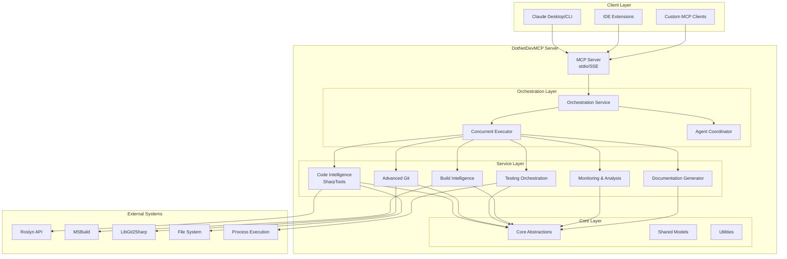

# DotNetDevMCP System Architecture Overview

**Version**: 0.1.0-alpha
**Last Updated**: 2025-12-30
**Status**: Initial Design

## Executive Summary

DotNetDevMCP is a comprehensive Model Context Protocol (MCP) server designed to be the ultimate one-stop shop for .NET developers. Built by forking and extending [SharpTools](https://github.com/kooshi/SharpToolsMCP), it combines deep Roslyn-based code intelligence with advanced orchestration capabilities, testing frameworks, Git integration, and performance monitoring.

## Design Philosophy

### Core Principles

1. **Performance Through Concurrency**: Maximize parallel operations for tests, builds, and analysis
2. **Context Efficiency**: Optimize for AI consumption with token-efficient responses
3. **Test-Driven Development**: All features backed by comprehensive tests
4. **Living Documentation**: Keep docs synchronized with code through automation
5. **Simplicity Over Complexity**: Prefer straightforward solutions that work
6. **Extensibility**: Plugin architecture for future enhancements

### Target Audience

- **Solo Developers**: Boost productivity with AI-assisted workflows
- **Development Teams**: Collaborative features and code review automation
- **Legacy Codebases**: Analysis and modernization tools
- **Greenfield Projects**: Scaffolding and best practice enforcement

## System Architecture

### High-Level Architecture Diagram



### Layer Responsibilities

#### 1. MCP Server Layer (`DotNetDevMCP.Server`)

**Purpose**: Protocol handling and request routing

**Responsibilities**:
- Implement MCP protocol (stdio and SSE transports)
- Route tool requests to appropriate services
- Manage sessions and state
- Handle authentication (if needed)
- Logging and diagnostics

**Key Classes**:
- `McpServer`: Main server implementation
- `StdioTransport`: Standard I/O transport
- `SseTransport`: Server-Sent Events (HTTP) transport
- `ToolRegistry`: Tool discovery and routing
- `SessionManager`: Client session management

#### 2. Orchestration Layer (`DotNetDevMCP.Orchestration`)

**Purpose**: Concurrent operations and workflow management

**Responsibilities**:
- Coordinate parallel operations across services
- Manage resource allocation
- Handle complex multi-step workflows
- Agent-based task distribution
- Error recovery and retry logic

**Key Classes**:
- `OrchestrationService`: Main orchestration coordinator
- `ConcurrentExecutor`: Parallel task execution engine
- `AgentCoordinator`: Multi-agent workflow management
- `WorkflowEngine`: Complex workflow orchestration
- `ResourceManager`: Resource allocation and throttling

**Key Features**:
- **Parallel Test Execution**: Run tests across projects simultaneously
- **Multi-Solution Analysis**: Analyze multiple solutions concurrently
- **Batch Operations**: Process multiple files/symbols in parallel
- **Smart Throttling**: Prevent resource exhaustion

#### 3. Service Layer

##### 3.1 Code Intelligence (`DotNetDevMCP.CodeIntelligence`)

**Purpose**: Roslyn-based code analysis (SharpTools integration)

**Inherited from SharpTools**:
- Solution/Project loading and analysis
- Symbol navigation (FQN fuzzy matching)
- Type hierarchy and implementations
- Find references
- Code modifications (add, rename, move members)
- Complexity analysis

**Extensions**:
- Enhanced batch operations
- Performance profiling integration
- Concurrent symbol resolution

##### 3.2 Source Control (`DotNetDevMCP.SourceControl`)

**Purpose**: Advanced Git integration (Level C - Deep)

**Features**:
- **Basic Operations**: Status, diff, log, blame
- **Merge Analysis**: Conflict detection and resolution strategies
- **Code Review**: Automated review suggestions based on changes
- **Branch Management**: Strategy recommendations, cleanup
- **History Analysis**: Impact analysis, dependency tracking
- **Pull Request Intelligence**: Affected tests, risk assessment

**Key Classes**:
- `GitService`: Core Git operations
- `MergeAnalyzer`: Merge conflict analysis
- `CodeReviewEngine`: Automated review generation
- `BranchStrategyAdvisor`: Branch management recommendations
- `HistoryAnalyzer`: Commit history insights

##### 3.3 Testing (`DotNetDevMCP.Testing`)

**Purpose**: Test orchestration and execution

**Features**:
- **Multi-Framework Support**: xUnit, NUnit, MSTest
- **Parallel Execution**: Run tests concurrently across projects
- **Coverage Analysis**: Aggregate and analyze coverage
- **Smart Test Selection**: Run only affected tests
- **Result Aggregation**: Unified test results across frameworks

**Key Classes**:
- `TestDiscoveryService`: Find tests across solutions
- `TestExecutor`: Parallel test execution
- `CoverageAnalyzer`: Coverage analysis and reporting
- `TestSelector`: Intelligent test selection
- `ResultAggregator`: Unified result reporting

##### 3.4 Build Intelligence (`DotNetDevMCP.Build`)

**Purpose**: MSBuild integration and build analysis

**Features**:
- **Build Diagnostics**: Parse and analyze build output
- **Dependency Analysis**: Project and package dependencies
- **Pipeline Intelligence**: CI/CD pipeline recommendations
- **Build Optimization**: Identify bottlenecks
- **Warning/Error Analysis**: Categorize and prioritize issues

**Key Classes**:
- `BuildService`: MSBuild execution and analysis
- `DiagnosticsParser`: Parse build diagnostics
- `DependencyAnalyzer`: Dependency graph analysis
- `PipelineAdvisor`: CI/CD recommendations
- `BuildOptimizer`: Build performance optimization

##### 3.5 Monitoring & Analysis (`DotNetDevMCP.Monitoring`)

**Purpose**: Log analysis and performance profiling

**Features**:
- **Log Pattern Detection**: Identify error patterns
- **Performance Profiling**: Analyze performance bottlenecks
- **Error Aggregation**: Group and prioritize errors
- **Metrics Analysis**: Track code metrics over time
- **Anomaly Detection**: Identify unusual patterns

**Key Classes**:
- `LogAnalyzer`: Log parsing and pattern detection
- `PerformanceProfiler`: Performance analysis
- `ErrorAggregator`: Error grouping and prioritization
- `MetricsTracker`: Code metrics tracking
- `AnomalyDetector`: Pattern anomaly detection

##### 3.6 Documentation (`DotNetDevMCP.Documentation`)

**Purpose**: AI-friendly documentation generation

**Features**:
- **XML Doc Extraction**: Extract and format XML documentation
- **Markdown Generation**: Generate API documentation
- **Architecture Diagrams**: Auto-generate Mermaid diagrams
- **Context File Updates**: Keep project-context.json synchronized
- **API Documentation**: Generate comprehensive API docs

**Key Classes**:
- `DocumentationGenerator`: Main doc generation
- `XmlDocExtractor`: XML documentation extraction
- `MarkdownFormatter`: Markdown generation
- `DiagramGenerator`: Architecture diagram generation
- `ContextUpdater`: project-context.json maintenance

#### 4. Core Layer (`DotNetDevMCP.Core`)

**Purpose**: Shared abstractions and utilities

**Contents**:
- `Interfaces`: Core service interfaces
- `Models`: Shared data models
- `Extensions`: Extension methods
- `Utilities`: Common utilities
- `Exceptions`: Custom exception types

## Concurrent Operations Architecture

### Strategy

DotNetDevMCP prioritizes concurrent operations to maximize performance:

1. **Parallel Task Execution**: Use `Task.WhenAll` for independent operations
2. **Async/Await Throughout**: All I/O operations are async
3. **Resource Pooling**: Shared resources (e.g., Roslyn workspaces) pooled
4. **Smart Throttling**: Limit parallelism to prevent resource exhaustion
5. **Cancellation Support**: All operations support cancellation tokens

### Example: Parallel Test Execution

```csharp
// Discover tests across all projects
var testProjects = await testDiscovery.DiscoverAsync(solution);

// Execute tests in parallel with throttling
var results = await Parallel.ForEachAsync(
    testProjects,
    new ParallelOptions { MaxDegreeOfParallelism = Environment.ProcessorCount },
    async (project, ct) => await testExecutor.RunAsync(project, ct)
);

// Aggregate results
var summary = resultAggregator.Aggregate(results);
```

### Example: Multi-Solution Analysis

```csharp
// Load multiple solutions concurrently
var solutions = await Task.WhenAll(
    solutionPaths.Select(path => solutionLoader.LoadAsync(path))
);

// Analyze each solution in parallel
var analyses = await Task.WhenAll(
    solutions.Select(sln => analyzer.AnalyzeAsync(sln))
);

// Merge results
var mergedAnalysis = analysisMerger.Merge(analyses);
```

## Data Flow

### Request Flow

```
1. MCP Client sends tool request
   ↓
2. McpServer receives and validates request
   ↓
3. ToolRegistry routes to appropriate service
   ↓
4. OrchestrationService coordinates operation
   ↓
5. Service layer executes (potentially in parallel)
   ↓
6. Results aggregated and formatted
   ↓
7. Response sent back to MCP Client
```

### Error Handling Flow

```
1. Exception thrown in service
   ↓
2. Caught by OrchestrationService
   ↓
3. Logged with context
   ↓
4. Retry logic applied (if applicable)
   ↓
5. User-friendly error message generated
   ↓
6. Partial results returned if available
```

## Technology Stack

### Core Technologies

- **.NET 9.0**: Runtime and SDK
- **C# 13**: Language version
- **Roslyn**: Code analysis engine
- **MSBuild**: Build system
- **LibGit2Sharp**: Git operations
- **xUnit**: Testing framework (for DotNetDevMCP itself)

### Key NuGet Packages

- `Microsoft.CodeAnalysis.CSharp`: Roslyn C# analysis
- `Microsoft.Build`: MSBuild integration
- `LibGit2Sharp`: Git operations
- `System.Text.Json`: JSON serialization
- `Microsoft.Extensions.DependencyInjection`: DI container
- `Microsoft.Extensions.Logging`: Logging abstraction

## Deployment

### MCP Server Deployment

**Stdio Mode** (Default):
```json
{
  "mcpServers": {
    "dotnetdev": {
      "command": "dotnet",
      "args": [
        "/path/to/DotNetDevMCP.Server.dll",
        "--mode", "stdio"
      ]
    }
  }
}
```

**SSE Mode** (Remote):
```json
{
  "mcpServers": {
    "dotnetdev": {
      "url": "http://localhost:5000/mcp",
      "transport": "sse"
    }
  }
}
```

## Performance Characteristics

### Expected Performance

- **Symbol Resolution**: < 100ms for most symbols
- **Solution Loading**: 1-5 seconds (depends on size)
- **Test Execution**: Parallel execution reduces time by 50-80%
- **Code Analysis**: Concurrent analysis across files
- **Memory Usage**: ~500MB baseline + ~100MB per loaded solution

### Scalability

- **Small Projects** (< 100 files): Instant response
- **Medium Projects** (100-1000 files): 1-2 second response
- **Large Projects** (1000-10000 files): 2-10 second response
- **Very Large Projects** (> 10000 files): Streaming responses, progressive loading

## Security Considerations

- **Local Trust Model**: MCP server runs locally, trusts local environment
- **No Network Exposure** (stdio mode): No external attack surface
- **Process Isolation**: Runs in separate process from client
- **File System Access**: Limited to workspace directory (configurable)
- **Code Execution**: Only via dotnet CLI (no arbitrary code execution)

## Future Enhancements

See [project-context.json](../ai-context/project-context.json) for detailed roadmap.

### Potential Additions

- **F# Support**: Extend to F# codebases
- **VB.NET Support**: Legacy VB.NET support
- **Remote Workspaces**: Support for remote dev environments
- **Cloud Integration**: Azure DevOps, GitHub Actions integration
- **AI Code Generation**: Integrated code generation
- **Real-time Collaboration**: Multi-user support

## References

- [MCP Protocol Specification](https://modelcontextprotocol.io)
- [Roslyn Documentation](https://github.com/dotnet/roslyn)
- [SharpTools Original Project](https://github.com/kooshi/SharpToolsMCP)
- [Architecture Decision Records](./adr/)

---

**Next**: See [ADR Index](./adr/README.md) for detailed architectural decisions.
