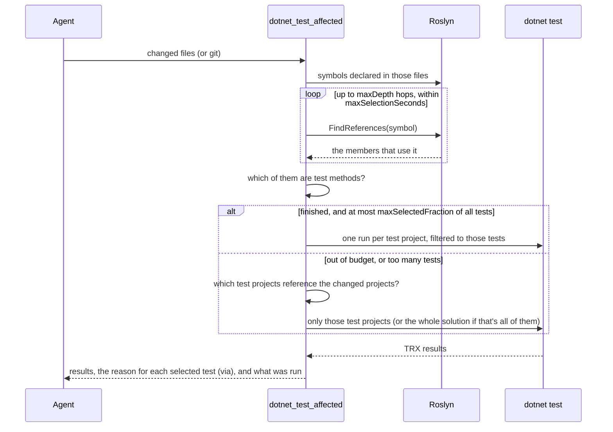

# Affected tests

`dotnet_test_affected` answers "which tests can my change break?" with the compiler, then runs only those.

## How it decides

<!-- mermaid: rendered on GitHub; see the SVG diagrams for the Pages version -->

1. **Changed files**: from `changedFiles`, or from git (uncommitted changes, or `gitBase: "main"` for a branch).
2. **Symbols**: everything the files declare that can run: methods, properties, constructors. A type or field hops through
   its constructors (field initializers run there) and, for fields, through everything that reads them. That's how xUnit
   `[MemberData]` theories are found.
3. **Reference walk**: Roslyn finds every member that uses those symbols, then every member using *those*, up to
   `maxDepth` hops (default 8).
4. **Test methods**: members with `[Fact]`, `[Theory]`, `[Test]`, `[TestCase]`, `[TestCaseSource]`, `[TestMethod]` or
   `[DataTestMethod]`.

## When it doesn't filter by test name

| Situation | Why | What runs |
|---|---|---|
| The walk didn't finish within `maxSelectionSeconds` (10) | The change touches code nearly everything depends on; tracing it costs more than running tests | The test projects that reference the changed projects |
| The selection is more than `maxSelectedFraction` (20%) of all test methods | A filtered run that large is no faster than running those projects whole (measured on Polly) | Same |
| A changed file isn't compiled C# (`.csproj`, `.razor`, `appsettings.json`, resources, a deleted `.cs` file) | The reference walk can't see it, but it can still break tests | The test projects that reference the project folder holding it; the file is listed in `untracedFiles` |
| A build-wide file changed (`.props`, `.targets`, `global.json`, `nuget.config`, `.editorconfig`) | It can affect every project | The whole solution |
| Every test project is reachable | Nothing to narrow | The whole solution, in one run |

The response says what ran and why: `ranScope` is `selection`, `projects` or `solution`, `testProjectsRun` lists the projects,
and `note` explains the reason. A partial selection is never presented as complete. The project step follows project
references only: a test project that uses the changed code through a NuGet package reference isn't found. On a solution
where every test project uses the changed library (Polly and `Polly.Core`), this still runs everything; it narrows when
modules are independent.

## Parameters

| Parameter | Default | Meaning |
|---|---|---|
| `changedFiles` | git working tree | Files to start from |
| `gitBase` | - | Diff against this ref instead, e.g. `main` |
| `dryRun` | false | Only list the tests and why |
| `maxDepth` | 8 | Reference hops. `3` narrows more changes but misses tests reached through long call chains |
| `maxSelectionSeconds` | 10 | Time budget for the walk |
| `maxSelectedFraction` | 0.2 | Above this share of all tests, run everything |
| `framework` | all | Run one target framework, e.g. `net10.0` |
| `noBuild` | false | Skip building the affected test projects |
| `timeoutSeconds` | 600 | Kill the run if a test hangs; the response names the modules that never finished |

## What it can't see

- **Reflection** (`Activator.CreateInstance`, `GetMethod`, `BindingFlags`), **string-keyed lookups**, and **DI by
  convention** (assembly scanning). A test that reaches your code only that way won't be selected. On Polly this was the
  one miss out of 112 broken tests.
- **Documentation and files outside every project** (`*.md`, images, CI workflows) are ignored: they can't break a test.
- Calls through an **interface or base class** *are* followed: changing `OrderService.Submit` selects a test that only calls
  `IOrderService.Submit`.
- **Hanging tests** are killed after `timeoutSeconds` and reported by module, not by test name (VSTest runs do name the test).
- **The first selection of a session** on busy code can hit the time budget and run everything; Roslyn caches what it
  learned, so the same selection is fast the next time.

## Test frameworks

VSTest (`dotnet test` classic) and Microsoft.Testing.Platform (`"test": { "runner": "Microsoft.Testing.Platform" }` in
global.json) are both supported, with xUnit v3 detected automatically and MSTest/NUnit handled through `--filter`.
DotNetDevMCP runs `dotnet` from your project's directory, so your `global.json` (SDK version, test runner) applies.

Numbers: [Benchmarks](benchmarks.md).
