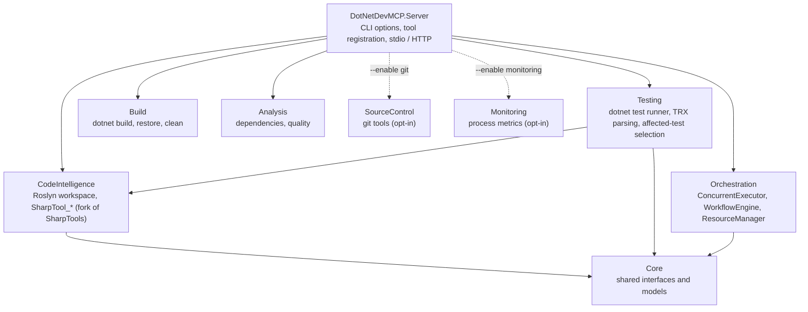
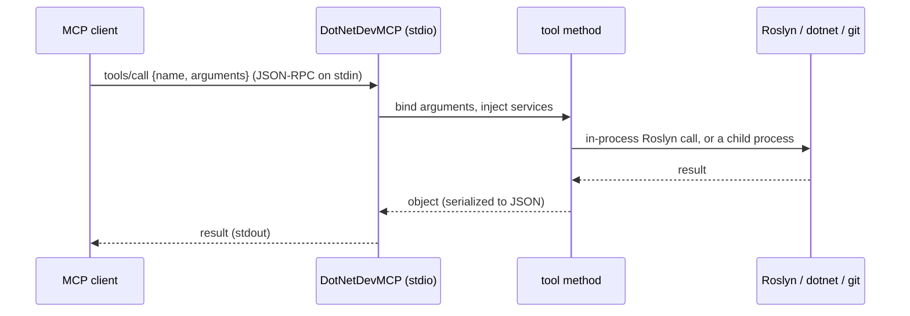

# Architecture

A map for contributors. The code is in [csa7mdm/DotNetDevMCP](https://github.com/csa7mdm/DotNetDevMCP).

## Projects

<!-- mermaid: rendered on GitHub; see the SVG diagrams for the Pages version -->

| Project | Start reading at |
|---|---|
| Server | `Program.cs`: options and `AddServices`, the one place every tool is registered |
| CodeIntelligence | `Services/SolutionManager.cs` (loading), `Mcp/Tools/AnalysisTools.cs` (find references), `Services/CodeModificationService.cs` (edits) |
| Testing | `TestRunner.cs` (VSTest and Microsoft.Testing.Platform), `AffectedTestFinder.cs` (the reference walk), `Mcp/Tools/TestingTools.cs` |
| Orchestration | `WorkflowEngine.cs`, `ConcurrentExecutor.cs`, `Mcp/Tools/OrchestrationTools.cs` |

## A tool call, end to end

<!-- mermaid: rendered on GitHub; see the SVG diagrams for the Pages version -->

Two consequences of stdio that every contributor should know:

- **stdout is the protocol.** Logs go to stderr. Child processes get their own redirected stdout and a closed stdin;
  otherwise they read from the MCP connection and hang.
- **Tool parameters are arrays.** The MCP C# SDK tries to resolve `IEnumerable<T>` parameters from dependency injection;
  use `string[]`.

## Design decisions

Architecture decision records are in [docs/architecture/adr](https://github.com/csa7mdm/DotNetDevMCP/tree/main/docs/architecture/adr),
starting with why the Roslyn tools are a fork of [SharpTools](https://github.com/kooshi/SharpToolsMCP) rather than a
package reference.

How affected tests are chosen: [Affected Tests](affected-tests.md). Next: [Contributing](contributing.md).
