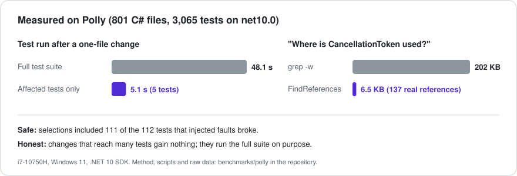

# Benchmarks

Measured on [Polly](https://github.com/App-vNext/Polly) (801 C# files, test projects multi-targeted to net8/9/10, 12,262
test executions, xUnit v3 on Microsoft.Testing.Platform) with the packaged server, driven over stdio the way an agent calls
it. Full method, scripts and raw data: [benchmarks/polly](https://github.com/csa7mdm/DotNetDevMCP/blob/main/benchmarks/polly/README.md).

## Headline numbers

| Question | Result |
|---|---|
| How fast is a small change's test run? | 5 affected tests in 5.1 s, against 48.1 s for the full net10.0 suite (same session) |
| Is the selection safe? | Faults injected into 10 real methods: selections included 111 of the 112 tests the faults broke. The miss uses reflection |
| How often does selection help? | Of Polly's last 40 commits: 16 ran a filtered selection, 24 ran the full suite (broad changes, or out of the 10 s budget) |
| "Where is X used?" versus grep | `CancellationToken`: 137 real references in 6.5 KB, against 1,354 grep lines in 202 KB |

## What the numbers don't say

- Changes that reach hundreds of tests gain nothing. The tool runs the full suite for them on purpose.
- Absolute times varied a lot between sessions on the test laptop (the full net10.0 suite took 33 s in one, 48 s in
  another). Compare within a session.
- One repository, one machine. Numbers from your solution are very welcome in
  [Discussions](https://github.com/csa7mdm/DotNetDevMCP/discussions).

## What benchmarking changed

Running on Polly found six problems in 0.2.x: runs failed on every Microsoft.Testing.Platform repository, the repository's
`global.json` was ignored, selection never finished on multi-targeted solutions, `[MemberData]` tests were missed,
reference counts were inflated once per target framework, and big selections were slower than running everything. All
fixed in 0.3.0. One improvement (a background warm-up) measured no effect and was removed.
