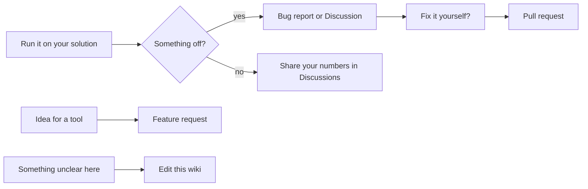

# Contributing

Contributions of every size are welcome, and not only code.


<!-- mermaid: rendered on GitHub; see the SVG diagrams for the Pages version -->


## Ways to help

1. **Try it on your own solution** and report what happened: large or multi-targeted solutions, and test suites on
   Microsoft.Testing.Platform, NUnit, MSTest or TUnit are the most valuable. [Bug report](https://github.com/csa7mdm/DotNetDevMCP/issues/new?template=bug_report.yml),
   or post your numbers in [Discussions](https://github.com/csa7mdm/DotNetDevMCP/discussions).
2. **Pick a [good first issue](https://github.com/csa7mdm/DotNetDevMCP/labels/good%20first%20issue).** Comment that you're
   on it; the maintainer answers questions and reviews quickly.
3. **Edit this wiki.** New MCP client setup, a clearer tutorial step, a troubleshooting entry.
4. **Propose a tool.** [Feature request](https://github.com/csa7mdm/DotNetDevMCP/issues/new?template=feature_request.yml):
   describe what your agent was trying to do and where it got stuck.

## Building and testing

```bash
git clone https://github.com/csa7mdm/DotNetDevMCP.git
cd DotNetDevMCP
dotnet build -c Release
dotnet test -c Release
```

To try your build from an MCP client, point the client at `src/DotNetDevMCP.Server/bin/Release/net10.0/dotnetdevmcp`
(`.exe` on Windows). The full guide, code style and pull request checklist are in
[CONTRIBUTING.md](https://github.com/csa7mdm/DotNetDevMCP/blob/main/CONTRIBUTING.md); the map of the code is on
[Architecture](architecture.md).

Changing how tests are selected or run? Re-run [benchmarks/polly](https://github.com/csa7mdm/DotNetDevMCP/blob/main/benchmarks/polly/README.md)
and put the before/after numbers in your pull request.

Everyone taking part follows the [Code of Conduct](https://github.com/csa7mdm/DotNetDevMCP/blob/main/CODE_OF_CONDUCT.md).
If the project saves you time, you can [sponsor its development](https://github.com/sponsors/csa7mdm).
