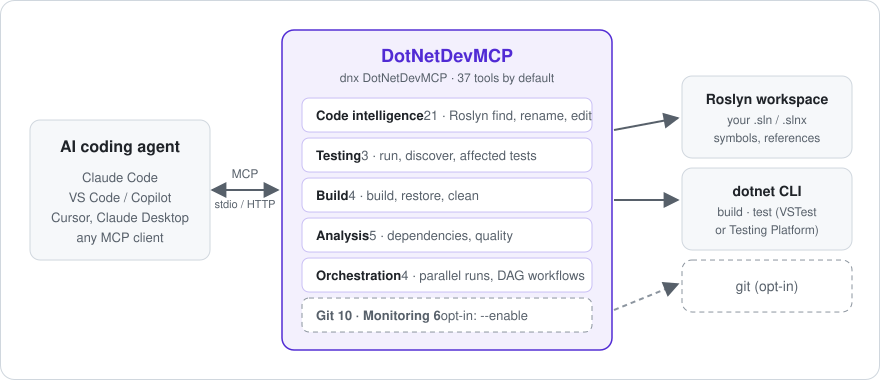

# DotNetDevMCP

DotNetDevMCP is an [MCP](https://modelcontextprotocol.io) server that gives AI coding agents the compiler's view of your .NET
solution. Instead of `grep` and guessing, your agent can find real references, rename a symbol across the solution with a
compile check, build, and run only the tests your change can break.



## Start here

| I want to... | Page |
|---|---|
| Install it in Claude Code, VS Code, Visual Studio, Cursor or Claude Desktop | [Installation](installation.md) |
| See what a first session looks like, step by step | [Tutorial](tutorial.md) |
| Know every tool and its parameters | [Tools Reference](tools-reference.md) |
| Understand how affected tests are chosen, and when it runs everything | [Affected Tests](affected-tests.md) |
| Change server options (`--load-solution`, `--enable`, HTTP mode...) | [Configuration](configuration.md) |
| Fix something that isn't working | [Troubleshooting](troubleshooting.md) |
| See real numbers on a real library | [Benchmarks](benchmarks.md) |
| Know what it can do on my machine, and how to limit it | [Security](security.md) |
| Understand the code before contributing | [Architecture](architecture.md) |
| Help out | [Contributing](contributing.md) |

## In one minute

```bash
claude mcp add dotnetdevmcp -- dotnet dnx DotNetDevMCP --yes
```

Then ask your agent: *"Load MySolution.sln and tell me where `OrderService.Submit` is used."*

Requires the [.NET 10 SDK](https://dotnet.microsoft.com/download/dotnet/10.0). Package: [nuget.org/packages/DotNetDevMCP](https://www.nuget.org/packages/DotNetDevMCP).
Also listed in the [MCP Registry](https://registry.modelcontextprotocol.io) as `io.github.csa7mdm/dotnetdevmcp`.

## Something missing or wrong?

This wiki is open to edits: fix it directly. For bugs, [open an issue](https://github.com/csa7mdm/DotNetDevMCP/issues/new/choose);
for questions, use [Discussions](https://github.com/csa7mdm/DotNetDevMCP/discussions).
