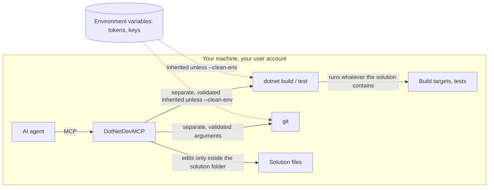

# Security

DotNetDevMCP is a local developer tool: it runs as you, for an AI agent you chose to trust with your code. This page says
exactly what that means. The authoritative version is [SECURITY.md](https://github.com/csa7mdm/DotNetDevMCP/blob/main/SECURITY.md#security-model);
on 0.3.0 or 0.3.1, upgrade: those versions lack the argument validation and the stricter path check. Vulnerabilities go to a [private report](https://github.com/csa7mdm/DotNetDevMCP/security/advisories/new), never a public issue.

<!-- mermaid: rendered on GitHub; see the SVG diagrams for the Pages version -->

## What to know

| Question | Answer |
|---|---|
| Can a build or test run arbitrary code? | **Yes.** `dotnet build`/`test` run MSBuild targets, source generators and test code from the solution, with your privileges, just as in your terminal. A malicious test or `.csproj` (written by the agent, or planted in a repository to steer it) runs when built. There is no sandbox. |
| Can a tool argument sneak in extra `dotnet` or `git` options? | No. Arguments are passed separately and validated: framework, configuration, runtime, MSBuild property names, git refs. Values like `net10.0 --logger:x`, `-p:CustomBeforeMicrosoftCommonTargets=...` or `--output=...` are rejected or passed as a single inert value. |
| Can edit tools write outside my solution? | No. Roslyn edit tools normalize the path and refuse anything outside the loaded solution's folder (including `..` tricks and look-alike sibling folders). Build, test and git tools accept any path they're given. |
| Do child processes see my secrets? | By default they inherit the server's environment variables. Start the server with `--clean-env` to give `dotnet` and `git` a minimal environment instead. That is not a sandbox: files like `~/.aws/credentials` and the network remain reachable. |
| Is `--http` safe to expose? | **No.** It listens on localhost only and has no authentication, TLS or origin checks. Don't forward the port, proxy it, or run it on a shared machine. |

## Recommended setups

| Situation | Setup |
|---|---|
| Your own code, your own machine | Defaults are fine. Consider `--clean-env` if you keep tokens in environment variables. |
| A repository you don't fully trust (a stranger's pull request, a downloaded sample) | Run the agent and DotNetDevMCP in a container or VM with only that repository mounted, no credentials, and restricted network. |
| CI, shared servers, several users | Not supported today. It would need authentication, a sandbox per session and audit logging. |

## Why it isn't sandboxed

A sandbox that still lets `dotnet build` restore packages and run tests means a container or VM per session, with its own
SDK, NuGet cache and network policy. That's a deployment concern outside a local stdio tool. If you need it,
[say so in Discussions](https://github.com/csa7mdm/DotNetDevMCP/discussions): demand decides what gets built next.
