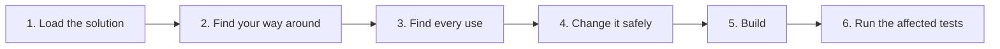
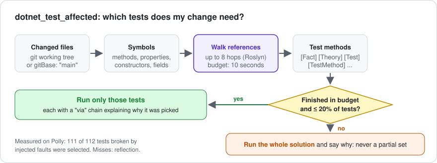

# Tutorial: your first session

This walks through one realistic session on your own solution: understand some code, change it safely, and check the
change with the tests that matter. You type the prompts in *italics* to your agent; the agent picks the tools. Tool names
are shown so you can recognize them in your client's tool-call view.

Before you start: [Installation](installation.md) done, and you know the path of your `.sln` or `.slnx`.

<!-- mermaid: rendered on GitHub; see the SVG diagrams for the Pages version -->

## 1. Load the solution

*"Load C:/src/MyApp/MyApp.sln."*

The agent calls `SharpTool_LoadSolution`. Roslyn opens every project, so this takes a few seconds on a small solution and
30 seconds or so on a large multi-targeted one (Polly, 801 files: about 30 s). It happens once per session. To skip it,
start the server with `--load-solution` (see [Installation](installation.md)).

The answer lists your projects with their target frameworks, namespaces and references. That's the map the agent uses
from here on.

## 2. Find your way around

*"What's in the Orders project? Show me the public API of OrderService."*

- `SharpTool_LoadProject` returns every type and member signature of a project without the agent reading files.
- `SharpTool_GetMembers` lists one type's members with their XML docs.
- `SharpTool_ViewDefinition` shows a member's source plus which types it uses and which types use it.

These answer in well under a second once the solution is loaded, and they use a fraction of the tokens that reading whole
files would.

## 3. Find every use

*"Where is OrderService.Submit used?"*

`SharpTool_FindReferences` asks the compiler, so it returns only real references to *that* `Submit`: not comments, not
other classes' `Submit` methods, not strings. On Polly, "where is `ResilienceContext.CancellationToken` used" came back as
137 references in 6.5 KB, where `grep -w CancellationToken` returns 1,354 lines (202 KB) because the name is everywhere.

*"Who implements IPaymentGateway?"* uses `SharpTool_ListImplementations`.

## 4. Change it safely

*"Rename OrderService.Submit to SubmitAsync everywhere."*

`SharpTool_RenameSymbol` renames the symbol and every reference across the solution, formats only the lines it changed,
and returns compiler errors and warnings for the files it touched. The diff stays small: a rename of one method in this
repository changes exactly the two lines that mention it.

Edits don't touch git. Your branch and history are left alone. If you want each edit committed on a separate branch
(and `SharpTool_Undo` to work), start the server with `--git-commit-edits`.

## 5. Build

*"Build the solution."*

`dotnet_build` returns a short summary: success, error and warning counts, every error, and the first 20 distinct warnings
with paths relative to your solution. Pass `verbose: true` if you ever need the raw MSBuild output.

## 6. Run the tests your change can break

*"Run the tests affected by my changes."*

`dotnet_test_affected` takes your changed files from git, walks Roslyn references from what they declare to the test
methods that reach them, and runs only those. Every test comes with a `via` chain explaining why it was picked, for
example `OrderService.cs -> Submit -> CheckoutController`.

It runs the whole solution instead, and tells you why, when your change reaches too much of the code to trace in
10 seconds or would select more than 20% of your tests. You never get a silently partial selection. On a multi-targeted
solution add *"only for net10.0"*: the agent passes `framework: "net10.0"`, and a small change's tests run in seconds
(Polly: 5 tests in 5.1 s against 48.1 s for the full suite).

Want to see the choice before running anything? *"Which tests would my change affect? Don't run them."* (`dryRun: true`).

More detail: [Affected Tests](affected-tests.md).

## Prompts to try next

- *"Find circular project references."* (`dotnet_detect_circular_dependencies`)
- *"Which methods in the Orders project are the most complex?"* (`SharpTool_AnalyzeComplexity`)
- *"Build Api and Worker in parallel, then run both test projects."* (`execute_workflow`)
- *"Add a CancellationToken parameter to every public async method in OrderService."* (`SharpTool_OverwriteMember`)

Something didn't work the way this page says? That's a bug in the tool or in this page: [tell us](https://github.com/csa7mdm/DotNetDevMCP/issues/new/choose).
